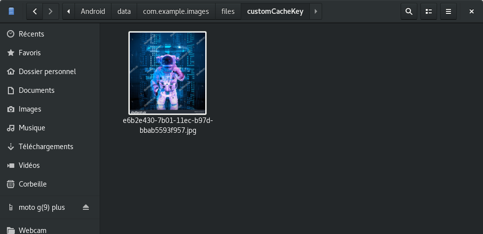

# What

Test storing image using cache feature

One keep taken from network, the second is cached.
Restart the application to see the magie !

The images are accessible from `user's data` directory instead of temporary directory (I have used `getExternalStorageDirectory` instead of `getTemporaryDirectory`)

# Resources
> https://stackoverflow.com/a/66950665/2570225

